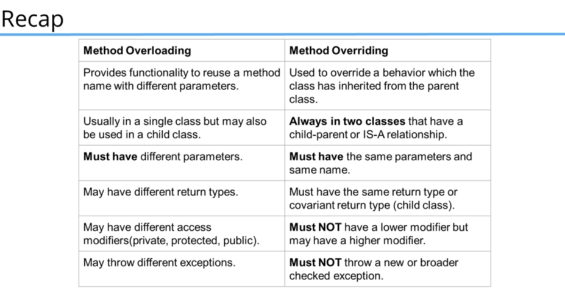

### This project includes the lessons and practices of MasterClass Java lesson from Tim Buchalka on Udemy

#### Starts from Section - 6

Section - 6

77 - Classes Part 1

    Class is a kind of template for creating a object
    A class can create a new kind of datatype by its own.

    Access modifiers :
     - Public means unrestricted access
     - Protected class can be accessed within the same package only.

78 - Classes Part 2

    Getter and setter used to hide the inner mechanism of the class
    In setter methods validations could be implemented.

79-80 - Constructors

    In constructors do not use any setter or getters.

81 - Inheritance

    super() --> means that call the constructor of the base class we want to inherit from.

83 - Class vs Instance vs Object

84 - super vs this keyword

    super is used to access parent class members such as variables and methods
    this is used to access current class members such as variables and methods
    both of them can not be used in static areas , it will throw a compile error.
    this() and super() calls used in constructors
    this() is used to call another constructor in a constructor (constructor chaining)
    only way to call a parent constructor is to use super() call.
    A constructor can not have both this() and super()

85 - method overriding vs overloading

    overloading : having a method more than 1 time within the class with different parameters
                  method return type may differ
                  may have different access modifiers
                  may throw different exceptions
    overriding :  overriding a parent class's method in child class
                  Must have same name and same arguments
                  Return type can be a subclass of the return type in the parent class.
                  Can't have a lower access modifier

                  Constructors and private methods can not be overridden
                  final method can not be overridden
                  
                  cant override static methods only instance methods

86 - static vs instance methods

    static : can not access instance methods and instance variables directly
             Usually used for operations that do not requiere any data from an instance of the class (fron 'this') --> 'this' is actually a current instance of the class
             in static methods we can not use this keywoard.
           !! Whenever you see a method that does not use instance variables that method should be declared as static
             
    
    instance : Instance methods belong to an instance of a class
               new instance of the class must be created first to use a instance method
               Instance methods can access both instance and static methods/variables directly

87 - Static vs Instance variables

    static : Every instance of that class shares the same static variable
             If changes are made to the static varibale all other instances will see the effect of the change
             static Scanner

    instance : also known as fields or member variables
               instance varibles belong to an instance of a class
               Every instance has it's own copy of instance variables
               Every instance can have different value

